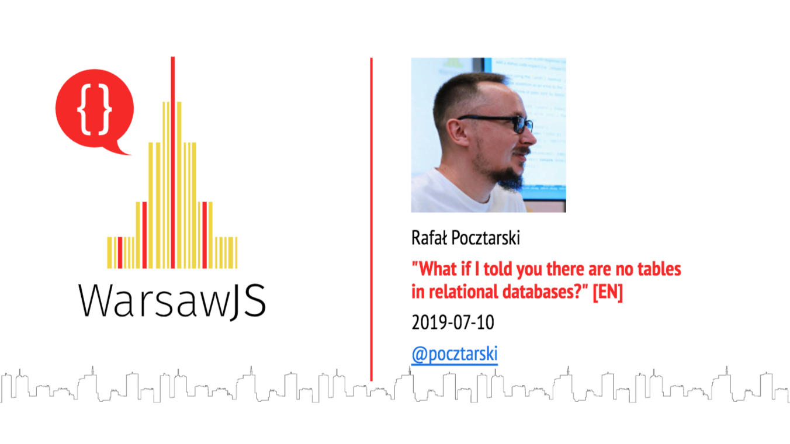

---

# Rafał Pocztarski

You may know me from Stack Overflow

# pocztarski.com

<small>(and also from Medium, Quora, etc.)</small>

---

# What if I told you

there are no tables in relational databases?

---

---

# Questions?

Slides: https://pocztarski.com/tant

## Rafał Pocztarski

## [pocztarski.com](https://pocztarski.com)

“Table is a list of rows.
Relation is a set of tuples.” - me
